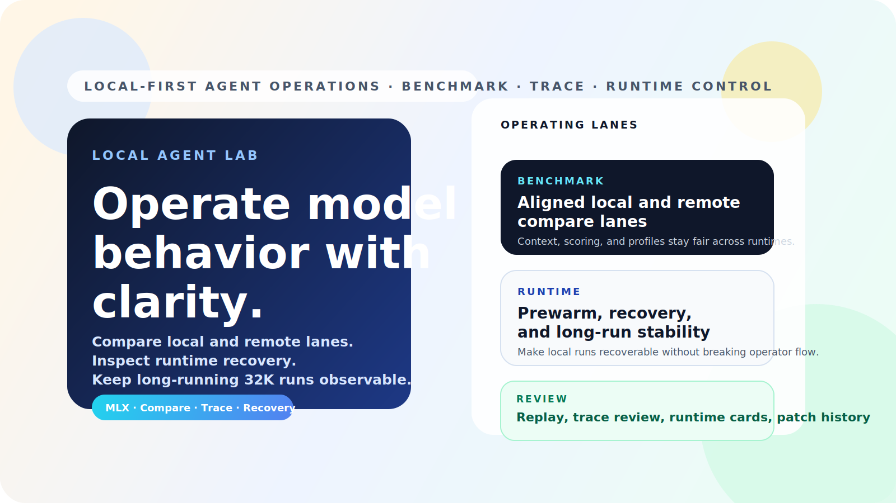
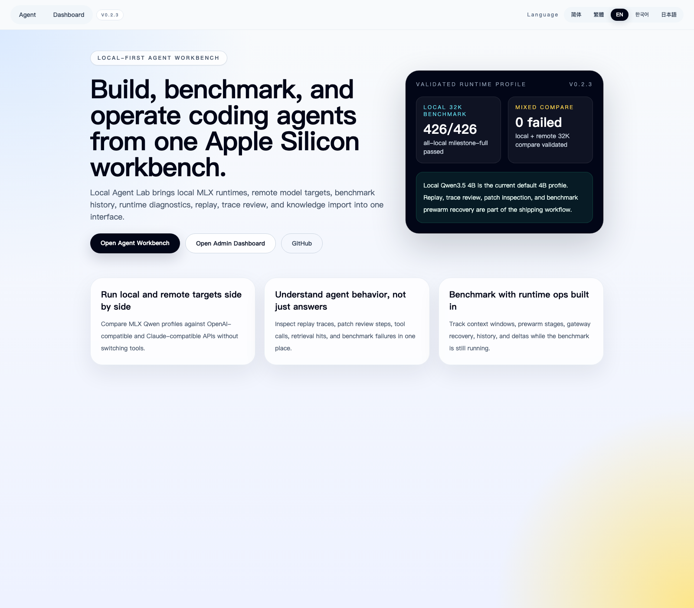
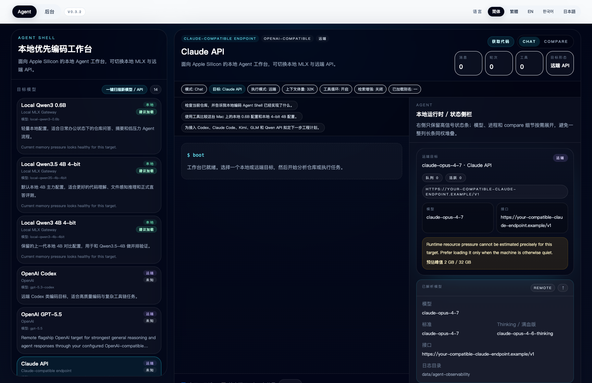
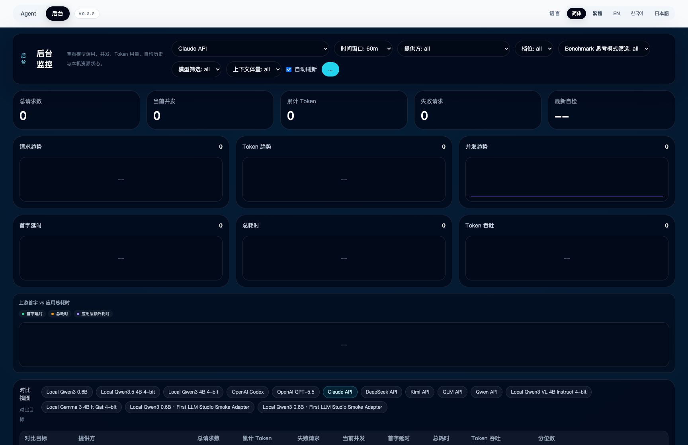

# Local Agent Lab

[English](./README.md) | [简体中文](./README.zh-CN.md)




Local Agent Lab is a local-first coding agent workbench for Apple Silicon. It gives us one place to:

- run local MLX models and remote APIs side by side
- benchmark coding and retrieval workflows with reproducible runs
- inspect replay traces, patch reviews, tool calls, and runtime recovery
- operate local gateways, model prewarm, and failure diagnostics without leaving the app

If most projects make you choose between an IDE agent, a local model playground, and a benchmark dashboard, this project is the attempt to keep those loops together.

## Why people will care

Most open tools do one slice well:

- coding agents focus on edit loops
- local model tools focus on inference
- eval tools focus on scores
- chat apps focus on conversation

Local Agent Lab is opinionated about keeping those surfaces in one workflow:

- `/agent` is where we run and inspect the agent
- `/admin` is where we benchmark, compare, prewarm, and debug

That matters when we want to answer questions like:

- Which local model is actually good enough for repo-aware coding?
- Is a benchmark regression caused by quality, latency, or runtime instability?
- Did the model answer well, or did the tool chain silently fall back?
- Can local and remote targets be compared under the same context budget?

## What stands out

- Local MLX runtime support for Apple Silicon
- Unified local + remote target catalog
- Built-in repo tools for file listing, file reads, command execution, patching, and gated writes
- Replay, trace review, and file-level diff inspection
- Benchmark history, baseline deltas, heatmaps, progress recovery, and failure classification
- Knowledge import with path scanning, preview, and recent-path shortcuts
- Runtime ops for model prewarm, release, restart, and gateway log inspection

## Proof, not just positioning

Current validated runtime profile:

- all-local `32K` formal benchmark: passed
- all-local `32K` milestone-full benchmark: `426 / 426 ok`
- mixed local + remote `32K` compare: `426 / 426 ok`
- local benchmark progress now exposes explicit prewarm states and recovery actions

Current default local 4B posture:

- `Local Qwen3.5 4B 4-bit` is the default local 4B profile
- `Local Qwen3 4B 4-bit` remains as a comparison target
- `Local Qwen3 0.6B` remains the lightweight local lane

## Screenshots





## Core surfaces

### Agent workbench

- switch local and remote models
- run tool-enabled conversations
- inspect replay traces and patch review cards
- compare structured outputs across targets

### Admin dashboard

- start formal and full benchmark suites
- monitor progress, recovery actions, and failure reasons live
- inspect local runtime state and gateway behavior
- review benchmark history, baselines, deltas, and mixed compare runs

## Current targets

### Local

- `Local Qwen3 0.6B`
- `Local Qwen3.5 4B 4-bit`
- `Local Qwen3 4B 4-bit`

### Remote

- `OpenAI Codex`
- `OpenAI GPT-5.4`
- `Claude API`
- `Kimi API`
- `GLM API`
- `Qwen API`

## Quick start

### Requirements

- macOS on Apple Silicon
- Node `22.x`
- Python `3.12`
- MLX-compatible local environment

### Install

```bash
nvm install 22
nvm use 22
npm install
cp .env.example .env.local
```

### Start the web app

```bash
npm run dev
```

Default routes:

- [http://localhost:3011/agent](http://localhost:3011/agent)
- [http://localhost:3011/admin](http://localhost:3011/admin)

### Start the local model gateway

```bash
python3.12 -m venv .venv
source .venv/bin/activate
pip install -U pip
pip install mlx mlx-lm fastapi uvicorn
python scripts/local_model_gateway_supervisor.py
```

Gateway health:

- [http://127.0.0.1:4000/health](http://127.0.0.1:4000/health)

## Configuration

Copy `.env.example` to `.env.local` and fill only the providers you want to use.

Important notes:

- `.env.local` is ignored by git
- remote providers are optional
- several targets use OpenAI-compatible or Claude-compatible endpoints
- public defaults in this repository are sanitized placeholders

## Repository structure

```text
app/                      Next.js app routes
components/               Agent and admin UI
lib/agent/                Agent runtime, providers, benchmark, gateway helpers
scripts/                  Local gateway, runtime, and dev scripts
docs/                     Release notes, launch notes, roadmap, project docs
public/                   Public assets and social cover art
```

## Open-source launch kit

We also keep a ready-to-use launch pack in the repo:

- [docs/open-source-launch-kit.md](./docs/open-source-launch-kit.md)
- [public/oss-cover.svg](./public/oss-cover.svg)
- [public/oss-cover.png](./public/oss-cover.png)
- [public/oss-social-square.svg](./public/oss-social-square.svg)
- [public/oss-social-square.png](./public/oss-social-square.png)
- [public/oss-feature-strip.svg](./public/oss-feature-strip.svg)

This includes:

- GitHub About copy
- release summary copy
- X / LinkedIn / Hacker News launch drafts
- suggested screenshot order
- social-preview asset references

## Security and privacy

- Sensitive local actions require confirmation
- Secrets belong in `.env.local`
- Public repository defaults are sanitized
- Historical commit identity has been rewritten to a GitHub noreply address for public release
- See [SECURITY.md](./SECURITY.md)

## Contributing

Issues and PRs are welcome.

- [CONTRIBUTING.md](./CONTRIBUTING.md)
- [CODE_OF_CONDUCT.md](./CODE_OF_CONDUCT.md)
- [docs/open-source-backlog.md](./docs/open-source-backlog.md)

## Release notes

- Current version: [`VERSION`](./VERSION)
- Release notes: [`docs/releases`](./docs/releases)
- Release process: [`docs/release-process.md`](./docs/release-process.md)
- Latest release: [v0.2.3](https://github.com/ChrisChen667788/local-agent-lab/releases/tag/v0.2.3)

## License

[MIT](./LICENSE)
