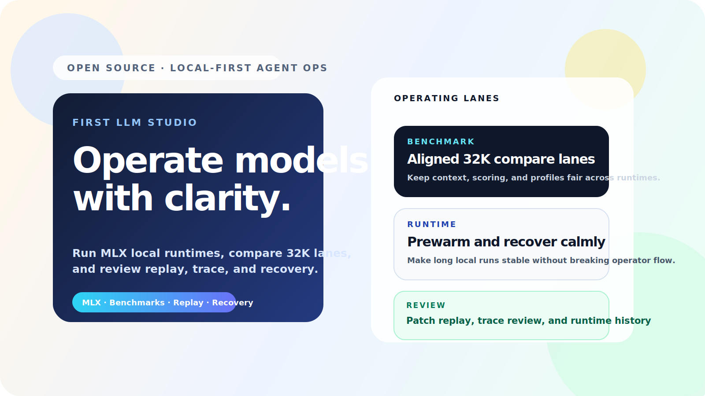
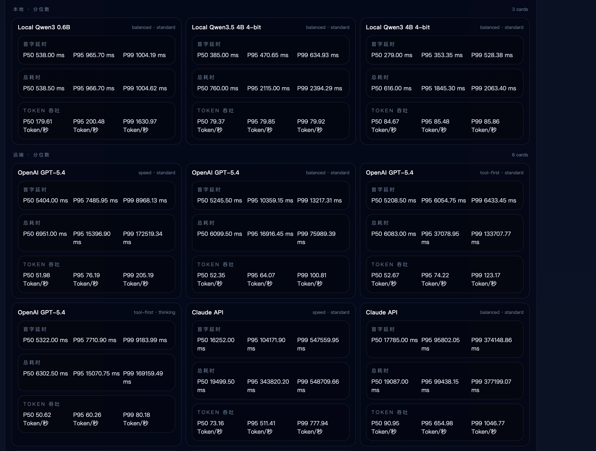
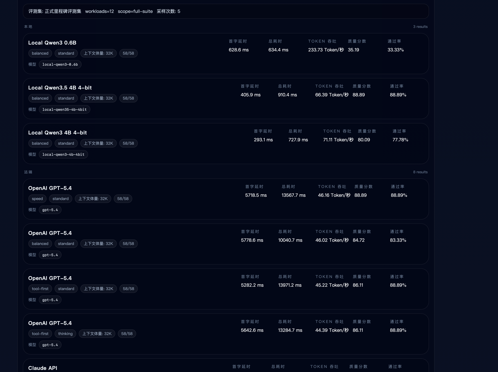
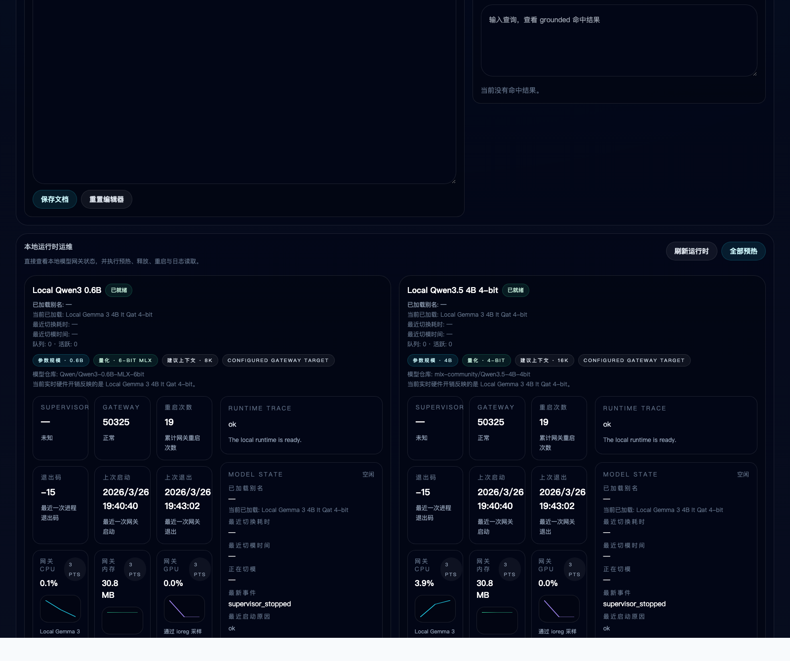

# First LLM Studio

[English](./README.md) | [简体中文](./README.zh-CN.md)




First LLM Studio is a local-first LLM workbench for Apple Silicon. It brings local MLX runtimes, remote API targets, benchmark operations, compare workflows, replay, trace review, runtime recovery, and model observability into one operating surface.

## Why this project matters

Most teams still split this workflow across too many disconnected tools:

- a local model playground for inference
- a chat app for prompt iteration
- a benchmark script or spreadsheet for evals
- shell scripts for gateway recovery and runtime debugging
- separate dashboards for remote APIs versus local models

First LLM Studio is built to keep those loops together so we can compare behavior, not just answers.

## Who it helps

### 1. Local AI builders on Apple Silicon

- compare MLX local models against hosted APIs under aligned context budgets
- inspect runtime cost, prewarm, release, and recovery without leaving the app
- decide which local model is actually usable for daily coding workflows

### 2. Agent and tooling teams

- validate tool-calling, repo-grounded reasoning, replay, and patch flows in one workbench
- turn compare runs into benchmark handoff without switching products
- inspect where failures come from: model quality, provider behavior, or runtime instability

### 3. Evaluation and platform engineers

- run formal and focused benchmark suites with repeatable profiles
- review baselines, deltas, run notes, and failure classification in `/admin`
- keep local and remote targets inside one comparable target catalog

## Core value

- Unified local + remote target catalog
- Built-in Compare Lab for model-vs-model review
- Formal / focused benchmark operations with history and baselines
- Replay, trace review, patch inspection, and exportable review notes
- Runtime operations for prewarm, release, restart, log inspection, and telemetry
- Dynamic local model discovery plus remote provider health scanning

## Current targets

### Local

- `Local Qwen3 0.6B`
- `Local Qwen3 4B 4-bit`
- `Local Qwen3.5 4B 4-bit`
- `Local Gemma 3 4B It Qat 4-bit`

### Remote

- `OpenAI Codex`
- `OpenAI GPT-5.4`
- `Claude API`
- `DeepSeek API`
- `Kimi API`
- `GLM API`
- `Qwen API`

## Product surfaces

### `/agent`

- run tool-enabled LLM sessions
- compare multiple targets under the same prompt and locked controls
- inspect prompt frame, runtime state, replay, and shareable review output
- scan newly discovered local models and configured remote APIs in one click

### `/admin`

- launch formal, full, and provider-focused benchmark suites
- inspect benchmark progress, recovery actions, failure causes, and run notes
- monitor local gateway CPU, memory, GPU, shared GPU memory, energy signal, and storage pressure
- manage prewarm, release, restart, and runtime log inspection per local target

## Why it is different from a generic LLM app

First LLM Studio is not trying to be another chat shell.

It is designed for people who need to:

- ship or evaluate local-first LLM workflows
- compare local and remote models under fair constraints
- debug tool behavior and runtime regressions
- keep experimentation, benchmark, and operations in one place

## Screenshots


## Proof snapshots

Benchmark percentile board:



Formal milestone regression summary:



Local runtime telemetry:



## Quick start

### Requirements

- macOS on Apple Silicon
- Node `22.x`
- Python `3.12`
- MLX-compatible local environment

### Install

```bash
nvm install 22
nvm use 22
npm install
cp .env.example .env.local
```

### Start the web app

```bash
npm run dev
```

Default routes:

- [http://localhost:3011/agent](http://localhost:3011/agent)
- [http://localhost:3011/admin](http://localhost:3011/admin)

### Start the local model gateway

```bash
python3.12 -m venv .venv
source .venv/bin/activate
pip install -U pip
pip install mlx mlx-lm
python scripts/local_model_gateway_supervisor.py
```

Gateway health:

- [http://127.0.0.1:4000/health](http://127.0.0.1:4000/health)

## Configuration

Copy `.env.example` to `.env.local` and fill only the providers you want to use.

Important notes:

- `.env.local` is ignored by git
- remote providers are optional
- several targets use OpenAI-compatible or Claude-compatible endpoints
- public defaults in this repository are sanitized placeholders

## Repository structure

```text
app/                      Next.js app routes
components/               Agent and admin UI
lib/agent/                Agent runtime, providers, benchmark, gateway helpers
scripts/                  Local gateway, runtime, and dev scripts
docs/                     Release notes, launch notes, roadmap, project docs
public/                   Public assets and social cover art
```

## Launch assets

The repository already includes a reusable launch kit:

- [docs/open-source-launch-kit.md](./docs/open-source-launch-kit.md)
- [docs/open-source-growth-copy.md](./docs/open-source-growth-copy.md)
- [docs/open-source-backlog.md](./docs/open-source-backlog.md)
- [public/oss-cover.svg](./public/oss-cover.svg)
- [public/oss-cover.png](./public/oss-cover.png)
- [public/oss-social-square.svg](./public/oss-social-square.svg)
- [public/oss-social-square.png](./public/oss-social-square.png)

## Security and privacy

- Sensitive local actions require confirmation
- Secrets belong in `.env.local`
- Public repository defaults are sanitized
- Historical commit identity has been rewritten to a GitHub noreply address for public release
- See [SECURITY.md](./SECURITY.md)

## Contributing

Issues and PRs are welcome.

- [CONTRIBUTING.md](./CONTRIBUTING.md)
- [CODE_OF_CONDUCT.md](./CODE_OF_CONDUCT.md)
- [docs/open-source-backlog.md](./docs/open-source-backlog.md)

## Release notes

- Current version: [`VERSION`](./VERSION)
- Release notes: [`docs/releases`](./docs/releases)
- Release process: [`docs/release-process.md`](./docs/release-process.md)
- Latest release note: [v0.3.0](./docs/releases/v0.3.0_2026-04-11.md)
