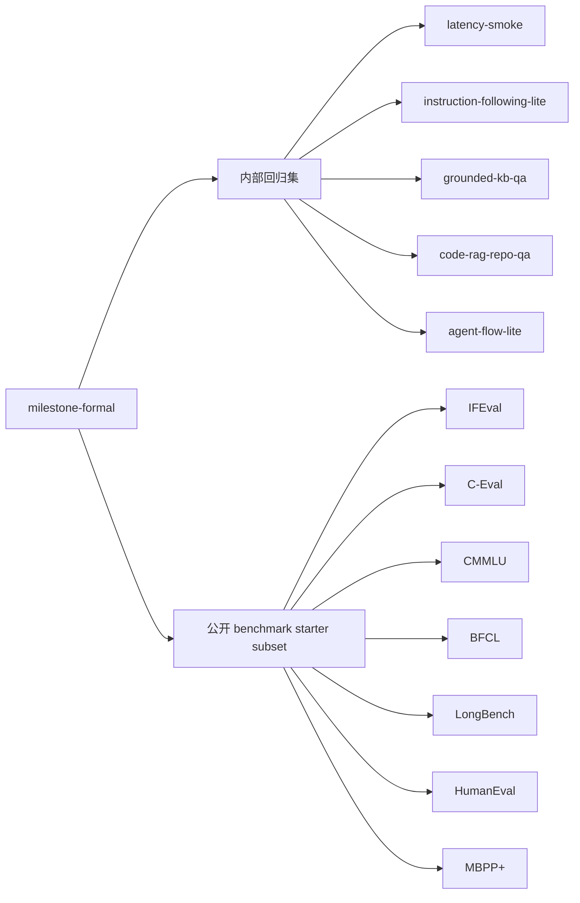

# 正式评测集维度覆盖图

## 目标

这份覆盖图用于说明当前 `milestone-formal` 正式评测集到底覆盖了哪些能力维度，哪些维度已经纳入公开专业 benchmark，哪些维度仍然主要依赖项目内部回归集，以及下一步最值得补的公开标准集。

当前正式套件定义见：
- `/lib/agent/benchmark-datasets.ts` 中的 `milestone-formal`
- `/lib/agent/benchmark-presets.ts` 中的内部 prompt set 定义

## 当前正式套件组成

`milestone-formal` 当前包含 12 个 workload：
- 5 个内部回归集
- 7 个公开 benchmark starter subset

## 评测维度覆盖矩阵

| 评测维度 | 当前 formal workload | 公开 benchmark 覆盖 | 内部回归覆盖 | 当前判断 | 下一步最值得补的公开标准集 |
| --- | --- | --- | --- | --- | --- |
| 性能 / 首字延时 / 总耗时 / 吞吐 | `latency-smoke` | 暂无直接纳入 | 有 | 当前完全依赖工程回归口径，适合做版本回归，但不适合做跨项目公开对标 | 暂不强行补。先继续沉淀自己的 serving 回归口径，后续如需要公开对标，再单独整理可复现实验协议 |
| 指令遵循 / 格式遵循 | `instruction-following-lite` + `ifeval-starter` | 有 | 有 | 已形成“内部快回归 + 公开标准集”双层覆盖 | 暂不缺口 |
| 中文知识 / 中文专业能力 | `ceval-cs-starter` + `cmmlu-cs-starter` | 有 | 无 | 覆盖较完整，适合看中文基础知识与专业表达 | 可按需要扩大 sample，而不是优先换集 |
| 工具调用 / 工具参数格式 | `bfcl-starter` | 有 | 间接有 | 工具 schema 与 function calling 已有公开 benchmark 支撑 | 后续可视需要补更复杂 multi-step tool benchmark |
| 长上下文材料问答 | `longbench-starter` | 有 | 无 | 长上下文读取与 grounded summarization 已有公开基线 | 如果后续重点转向更长 repo/context，可再补 repo-long-context 专项集 |
| Grounded QA / RAG 引用 / 低置信度处理 | `grounded-kb-qa` | 暂无直接纳入 | 有 | 当前这条线完全依赖内部工程回归，是 formal 套件里最明显的公开 benchmark 缺口之一 | `CRAG` 或 `RAGBench` |
| 仓库级代码检索问答 / Repo QA | `code-rag-repo-qa` | 暂无直接纳入 | 有 | 当前只靠内部题集，适合本项目真实场景，但对外可比性不够 | `RepoBench` 或偏 `CodeRAGBench` 风格的公开 repo QA 集 |
| Agent 规划 / 记忆 / 恢复 / 状态持久化 | `agent-flow-lite` | 暂无直接纳入 | 有 | 这是项目核心价值，但目前只有内部工程题集，没有公开标准集托底 | `τ-bench` 或 `ToolSandbox` 一类 tool-agent benchmark |
| 代码生成 | `humaneval-starter` + `mbppplus-starter` | 有 | 无 | 已有基础公共基线，适合观察纯代码生成 | 如果后续转向真实修仓库，可再补 `SWE-bench Lite` |

## 现状判断

### 已经有公开 benchmark 托底的维度
- 指令遵循：`IFEval`
- 中文知识：`C-Eval`、`CMMLU`
- 工具调用：`BFCL`
- 长上下文：`LongBench`
- 代码生成：`HumanEval`、`MBPP+`

### 目前还主要靠内部回归集的维度
- 性能 / 延时 / 吞吐：`latency-smoke`
- Grounded QA / RAG：`grounded-kb-qa`
- 仓库级代码检索问答：`code-rag-repo-qa`
- Agent 工作流：`agent-flow-lite`

### 最值得下一步补公开标准集的缺口
按和当前项目核心价值的贴合度排序：

1. **Grounded QA / RAG 公共基线**
   - 原因：项目已经明确强调 grounded generation、citation enforcement、retrieval fallback。
   - 当前问题：只有内部 `grounded-kb-qa`，对外说服力还不够。
   - 候选：`CRAG`、`RAGBench`。

2. **Repo QA / Code RAG 公共基线**
   - 原因：项目已经有 repo-grounded agent 和代码检索链路。
   - 当前问题：`code-rag-repo-qa` 贴合真实场景，但对外可比性弱。
   - 候选：`RepoBench`，或继续向 `CodeRAGBench` 风格靠拢。

3. **Agent / Tool Workflow 公共基线**
   - 原因：`agent-flow-lite` 是项目差异化能力之一。
   - 当前问题：当前没有公开 benchmark 来证明 Planner / Memory / Recovery 这条线。
   - 候选：`τ-bench`、`ToolSandbox`。

4. **真实仓库修复公共基线**
   - 原因：如果后续想强调“coding agent 真能改仓库而不只是答题”，就需要更贴近真实工程任务的公共集。
   - 当前问题：`HumanEval` / `MBPP+` 只覆盖代码生成，不覆盖 repo repair。
   - 候选：`SWE-bench Lite`。

## 推荐的补强顺序

### 第一优先级
- `CRAG` / `RAGBench`
- `RepoBench`

这两条最贴合当前项目已经在做的事情：
- grounded generation
- retrieval
- repo QA
- code-aware compare / benchmark

### 第二优先级
- `τ-bench` / `ToolSandbox`

这条适合在 Compare Lab、tool loop、agent recovery 更稳定之后再接，因为它更依赖完整 agent workflow，而不只是单轮问答。

### 第三优先级
- `SWE-bench Lite`

这条价值很高，但对当前项目来说接入成本和运行成本都明显更大，适合放在前两层稳定以后再做。

## 对后续版本规划的意义

如果继续沿着当前项目的主线推进：
- `/agent` 负责 compare、交互、repo-grounded 执行
- `/admin` 负责 benchmark、report、runtime ops

那么 benchmark 规划上最合理的方向不是继续堆更多通用问答集，而是：
- 用公开 benchmark 补齐 **RAG / Repo QA / Agent workflow** 三条关键缺口
- 保留内部回归集去覆盖你项目独有的工程约束和运行时行为

换句话说，正式评测集下一阶段最应该长成：
- **公开 benchmark 负责对外可比性**
- **内部回归集负责工程真实性和产品相关性**
